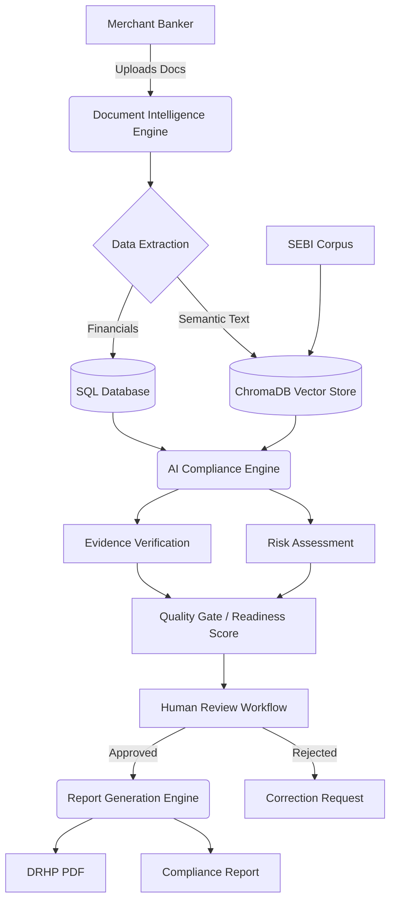

# System Architecture Document
*AI-Assisted IPO Compliance Review & Regulatory Intelligence Platform*

## 1. Executive Summary
This document outlines the current state and target state architecture of the SEBI IPO Copilot platform. It serves as the foundational blueprint for transforming the platform into a government-grade enterprise regulatory intelligence system.

## 2. System Overview
The platform operates as a secure web application with an asynchronous AI pipeline. It ingests financial and legal documents, extracts structured data and semantic context, applies regulatory compliance checks against a SEBI corpus, and outputs multi-dimensional intelligence reports and compliance dashboards.

## 3. Technology Stack (Current)
- **Frontend**: React, TypeScript, Tailwind CSS, Vite.
- **Backend**: FastAPI (Python 3.12).
- **Database**: PostgreSQL / SQLite (via SQLAlchemy).
- **Vector Store**: ChromaDB (for RAG and SEBI regulations corpus).
- **AI/LLM**: LangChain, modular LLM Client (supporting Gemini/Claude).
- **Document Processing**: PyMuPDF, ReportLab (PDF Generation).

## 4. Data Models & Entities (Current Backend Structure)
The domain is modelled through SQLAlchemy entities in `backend/app/models/`:
- **User Management**: `user.py` (roles: analyst), `refresh_token.py`, `token_blacklist.py`
- **Workflows**: `workspace.py`, `company.py`, `document.py`, `version.py`
- **Audit & Review**: `audit_event.py`, `review.py`
- **AI & Compliance**: `compliance_check.py`, `validation_result.py`, `copilot.py`
- **System**: `cache.py`, `corpus_version.py`

## 5. Security Model (Current)
- **Authentication**: JWT-based access and refresh tokens. Strict token blacklisting.
- **Authorization**: Basic role-based access. Needs expansion to Administrator, Regulatory Officer, Reviewer, Merchant Banker, Company User.
- **Workspace Isolation**: Documents and compliance runs are scoped to Workspaces.

## 6. AI & Compliance Workflow (Target State)
1. **Ingestion**: Documents are uploaded via `documents.py` router.
2. **Extraction**: Document Intelligence Pipeline performs OCR and extracts claims.
3. **Evidence Linking**: RAG pipeline indexes claims into ChromaDB.
4. **Validation**: Claim Validator cross-references extracted claims against the SEBI Corpus.
5. **Scoring**: Readiness Engine aggregates Financial, Regulatory, and Risk scores.
6. **Reporting**: DRHP Pipeline generates the final PDF with Evidence Appendix and Quality Gates.
7. **Human Review**: Officer approval workflow. AI decisions cannot bypass human review.

## 7. Data Flow Diagram

